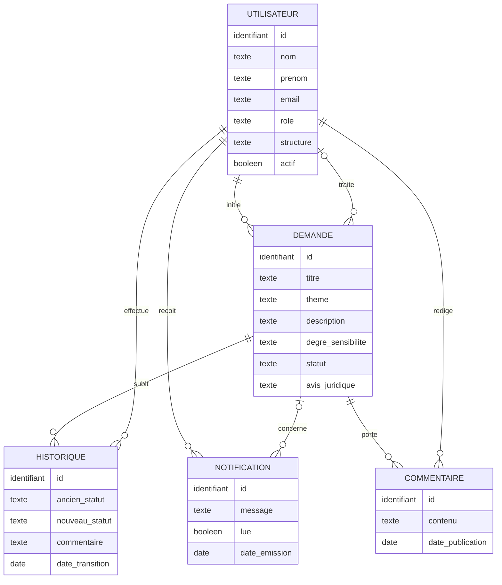
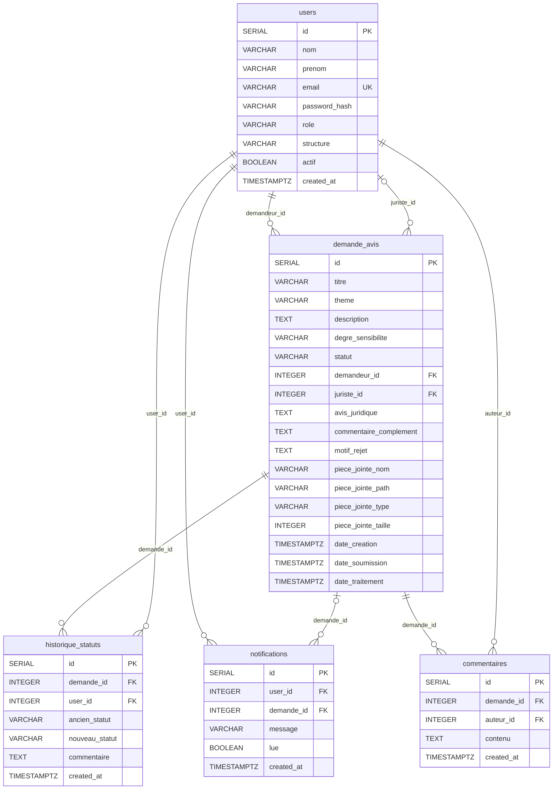

# DATABASE — Modèle de données

> **Livrable P0.1** · Source de vérité du schéma PostgreSQL
> Script associé : [`database/schema.sql`](../database/schema.sql)

---

## Sommaire

1. [Vue d'ensemble](#1-vue-densemble)
2. [Modèle Conceptuel de Données (MCD)](#2-modèle-conceptuel-de-données-mcd)
3. [Modèle Logique de Données (MLD)](#3-modèle-logique-de-données-mld)
4. [Dictionnaire de données](#4-dictionnaire-de-données)
5. [Décisions de conception](#5-décisions-de-conception)
6. [Règles métier portées par la base](#6-règles-métier-portées-par-la-base)

---

## 1. Vue d'ensemble

La base compte **5 tables**. `demande_avis` est l'entité centrale ; toutes les autres
gravitent autour d'elle et autour de `users`.

| Table | Rôle | Cardinalité clé |
|---|---|---|
| `users` | Comptes des 3 acteurs (Demandeur, Juriste, Admin) | — |
| `demande_avis` | Demandes d'avis juridiques + statut + pièce jointe | N demandes par demandeur |
| `notifications` | Notifications internes (sans email) | N notifications par user |
| `historique_statuts` | Journal immuable des transitions de statut | N lignes par demande |
| `commentaires` | Fil de discussion (optionnel — OPT01) | N commentaires par demande |

> Les deux modèles ci-dessous se lisent en cascade : le **MCD** (§2) décrit le métier sans
> technologie, le **MLD** (§3) le traduit en tables relationnelles avec clés et types, et le
> **dictionnaire** (§4) détaille chaque colonne. Les diagrammes sont en **Mermaid** et se
> rendent automatiquement sur GitHub.

---

## 2. Modèle Conceptuel de Données (MCD)

Le MCD décrit le métier **indépendamment de toute technologie** : les entités, leurs
propriétés, et les associations qui les relient, avec leurs **cardinalités** (notation Merise).
À ce niveau, il n'y a **ni clé étrangère ni type SQL** — les liens sont portés par les associations.



### Associations et cardinalités (Merise)

| Association | Entité 1 | Card. 1 | Entité 2 | Card. 2 | Sens de lecture |
|---|---|:---:|---|:---:|---|
| **Initier** | UTILISATEUR | (0,n) | DEMANDE | (1,1) | Un utilisateur initie 0..n demandes ; une demande est initiée par 1 et 1 seul demandeur |
| **Traiter** | UTILISATEUR | (0,n) | DEMANDE | (0,1) | Un juriste traite 0..n demandes ; une demande est traitée par 0 ou 1 juriste |
| **Subir** | DEMANDE | (1,n) | HISTORIQUE | (1,1) | Une demande subit 1..n transitions ; une transition porte sur 1 demande |
| **Effectuer** | UTILISATEUR | (0,n) | HISTORIQUE | (1,1) | Un utilisateur effectue 0..n transitions ; une transition est faite par 1 utilisateur |
| **Recevoir** | UTILISATEUR | (0,n) | NOTIFICATION | (1,1) | Un utilisateur reçoit 0..n notifications ; une notification a 1 destinataire |
| **Concerner** | DEMANDE | (0,n) | NOTIFICATION | (0,1) | Une demande concerne 0..n notifications ; une notification concerne 0 ou 1 demande |
| **Porter** | DEMANDE | (1,n) | COMMENTAIRE | (1,1) | Une demande porte 0..n commentaires ; un commentaire porte sur 1 demande |
| **Rédiger** | UTILISATEUR | (0,n) | COMMENTAIRE | (1,1) | Un utilisateur rédige 0..n commentaires ; un commentaire a 1 auteur |

> **Lecture de la notation Merise (min, max)** : `(0,1)` = optionnel, au plus un ·
> `(1,1)` = obligatoire, exactement un · `(0,n)` = optionnel, plusieurs possibles ·
> `(1,n)` = obligatoire, au moins un.
>
> **Double rôle de UTILISATEUR** : la même entité joue deux rôles distincts vis-à-vis de
> DEMANDE — **demandeur** (association *Initier*) et **juriste** (association *Traiter*).
> Ces deux rôles deviennent deux clés étrangères dans le MLD.

---

## 3. Modèle Logique de Données (MLD)

Le MLD est la **traduction relationnelle** du MCD : chaque entité devient une table, et chaque
association du côté « (x,1) » devient une **clé étrangère**. Les types SQL et les clés (PK/FK/UK)
apparaissent ici. C'est le modèle qu'implémente [`schema.sql`](../database/schema.sql).



### Passage du MCD au MLD (règles appliquées)

| Élément MCD | Devient dans le MLD |
|---|---|
| Entité UTILISATEUR | Table `users` |
| Entité DEMANDE | Table `demande_avis` |
| Entités HISTORIQUE / NOTIFICATION / COMMENTAIRE | Tables `historique_statuts` / `notifications` / `commentaires` |
| Association *Initier* (1,1 côté demande) | FK `demande_avis.demandeur_id → users.id` (NOT NULL) |
| Association *Traiter* (0,1 côté demande) | FK `demande_avis.juriste_id → users.id` (nullable) |
| Associations *Subir* / *Effectuer* | FK `historique_statuts.demande_id` / `.user_id` |
| Associations *Recevoir* / *Concerner* | FK `notifications.user_id` / `.demande_id` (nullable) |
| Associations *Porter* / *Rédiger* | FK `commentaires.demande_id` / `.auteur_id` |
| Propriété `email` (identifiant secondaire) | Contrainte `UNIQUE` (UK) |

> **PK** = clé primaire · **FK** = clé étrangère · **UK** = clé unique.

### Vue synthétique (schéma texte)

```
users (1) ──< initie  >── (N) demande_avis        [demandeur_id, obligatoire]
users (1) ──< traite  >── (N) demande_avis        [juriste_id, nullable]
demande_avis (1) ──< >── (N) historique_statuts   [demande_id]   |  users (1) ──< (N)
demande_avis (1) ──< >── (N) notifications         [demande_id, nullable]  |  users (1) ──< (N)
demande_avis (1) ──< >── (N) commentaires          [demande_id]   |  users (1) ──< (N)
```

---

## 4. Dictionnaire de données

### 4.1 Table `users`

| Colonne | Type | Null | Défaut | Contrainte | Description |
|---|---|---|---|---|---|
| `id` | SERIAL | NON | auto | PK | Identifiant |
| `nom` | VARCHAR(100) | NON | — | — | Nom de famille |
| `prenom` | VARCHAR(100) | NON | — | — | Prénom |
| `email` | VARCHAR(200) | NON | — | UNIQUE | Identifiant de connexion |
| `password_hash` | VARCHAR(255) | NON | — | — | Hash bcrypt (jamais le mot de passe en clair) |
| `role` | VARCHAR(20) | NON | `'DEMANDEUR'` | CHECK ∈ {DEMANDEUR, JURISTE, ADMIN} | Rôle applicatif |
| `structure` | VARCHAR(150) | OUI | — | — | Direction / agence de rattachement |
| `actif` | BOOLEAN | NON | `TRUE` | — | FALSE = compte désactivé (ne peut plus se connecter) |
| `created_at` | TIMESTAMPTZ | NON | `NOW()` | — | Date de création |

**Qui écrit quoi** : l'inscription est réservée à l'ADMIN (pas d'auto-inscription). `password_hash` est mis à jour via le endpoint de changement de mot de passe.

### 4.2 Table `demande_avis`

| Colonne | Type | Null | Défaut | Contrainte | Description |
|---|---|---|---|---|---|
| `id` | SERIAL | NON | auto | PK | Identifiant |
| `titre` | VARCHAR(250) | NON | — | — | Titre court de la demande |
| `theme` | VARCHAR(100) | NON | — | — | Thème juridique (voir §6.1) |
| `description` | TEXT | NON | — | — | Exposé de la problématique |
| `degre_sensibilite` | VARCHAR(50) | NON | — | CHECK ∈ {Faible, Moyen, Confidentiel} | Calculé auto selon le thème |
| `statut` | VARCHAR(50) | NON | `'Brouillon'` | CHECK (7 valeurs) | Position dans le workflow |
| `demandeur_id` | INTEGER | NON | — | FK users(id), RESTRICT | Auteur de la demande |
| `juriste_id` | INTEGER | OUI | — | FK users(id), RESTRICT | Juriste en charge (NULL avant prise en charge) |
| `avis_juridique` | TEXT | OUI | — | — | Rédigé à la validation |
| `commentaire_complement` | TEXT | OUI | — | — | Motif du complément demandé |
| `motif_rejet` | TEXT | OUI | — | — | Motif du rejet |
| `piece_jointe_nom` | VARCHAR(255) | OUI | — | — | Nom de fichier original |
| `piece_jointe_path` | VARCHAR(500) | OUI | — | — | Chemin disque `/uploads/<uuid>.<ext>` |
| `piece_jointe_type` | VARCHAR(100) | OUI | — | — | Type MIME |
| `piece_jointe_taille` | INTEGER | OUI | — | CHECK ≤ 10 485 760 | Taille en octets (max 10 Mo) |
| `date_creation` | TIMESTAMPTZ | NON | `NOW()` | — | Création du brouillon |
| `date_soumission` | TIMESTAMPTZ | OUI | — | — | Passage au statut Soumise |
| `date_traitement` | TIMESTAMPTZ | OUI | — | — | Clôture (Validée ou Rejetée) |

**Qui écrit `statut`** : uniquement le service `workflow` (voir [WORKFLOW.md](WORKFLOW.md)), jamais un UPDATE direct.

### 4.3 Table `notifications`

| Colonne | Type | Null | Défaut | Contrainte | Description |
|---|---|---|---|---|---|
| `id` | SERIAL | NON | auto | PK | Identifiant |
| `user_id` | INTEGER | NON | — | FK users(id), RESTRICT | Destinataire |
| `demande_id` | INTEGER | OUI | — | FK demande_avis(id), RESTRICT | Demande liée (NULL si notif système) |
| `message` | VARCHAR(500) | NON | — | — | Texte affiché |
| `lue` | BOOLEAN | NON | `FALSE` | — | Statut de lecture |
| `created_at` | TIMESTAMPTZ | NON | `NOW()` | — | Date d'émission |

### 4.4 Table `historique_statuts` (immuable)

| Colonne | Type | Null | Défaut | Contrainte | Description |
|---|---|---|---|---|---|
| `id` | SERIAL | NON | auto | PK | Identifiant |
| `demande_id` | INTEGER | NON | — | FK demande_avis(id), RESTRICT | Demande concernée |
| `user_id` | INTEGER | NON | — | FK users(id), RESTRICT | Auteur de la transition |
| `ancien_statut` | VARCHAR(50) | OUI | — | — | Statut avant (NULL à la création) |
| `nouveau_statut` | VARCHAR(50) | NON | — | — | Statut après |
| `commentaire` | TEXT | OUI | — | — | Commentaire associé (complément, rejet…) |
| `created_at` | TIMESTAMPTZ | NON | `NOW()` | — | Horodatage de la transition |

**Immuabilité** : INSERT uniquement. Aucune route ne fait UPDATE ni DELETE sur cette table.

### 4.5 Table `commentaires` (optionnelle — OPT01)

| Colonne | Type | Null | Défaut | Contrainte | Description |
|---|---|---|---|---|---|
| `id` | SERIAL | NON | auto | PK | Identifiant |
| `demande_id` | INTEGER | NON | — | FK demande_avis(id), RESTRICT | Demande concernée |
| `auteur_id` | INTEGER | NON | — | FK users(id), RESTRICT | Auteur du commentaire |
| `contenu` | TEXT | NON | — | — | Texte du message |
| `created_at` | TIMESTAMPTZ | NON | `NOW()` | — | Date de publication |

---

## 5. Décisions de conception

| # | Décision | Choix retenu | Justification |
|---|---|---|---|
| **D1** | Statuts : ENUM ou VARCHAR + CHECK ? | **VARCHAR + CHECK** | Plus simple à faire évoluer (ajouter un statut = modifier une contrainte, pas migrer un type). Lisibilité conservée grâce au CHECK. |
| **D2** | Rôles : ENUM ou VARCHAR + CHECK ? | **VARCHAR + CHECK** | Même raisonnement. 3 rôles figés, contrainte suffisante. |
| **D3** | Politique `ON DELETE` des FK | **RESTRICT partout** | On ne supprime jamais physiquement un user ni une demande (traçabilité). La désactivation (`actif=FALSE`) remplace la suppression. RESTRICT bloque toute suppression accidentelle. |
| **D4** | Index | 7 index (voir schema §6) | Couvrent les requêtes fréquentes : listes filtrées par statut/demandeur/juriste/thème, comptage des notifications non lues, chargement de l'historique. |
| **D5** | Type des dates | **TIMESTAMPTZ** | Stocke le fuseau : bonne pratique sans surcoût, évite les ambiguïtés d'heure. |
| **D6** | Validation du format email | **Applicative** (express-validator) + `UNIQUE` en base | Une regex en CHECK est fragile et peu maintenable. La contrainte d'unicité, elle, doit vivre en base. |

**Décision complémentaire — pièce jointe unique** : `demande_avis` porte 4 colonnes `piece_jointe_*`
plutôt qu'une table dédiée. Choix assumé : le besoin est d'**une** pièce par demande. Si le besoin
évoluait vers plusieurs pièces, on introduirait une table `pieces_jointes (id, demande_id, …)`.

---

## 6. Règles métier portées par la base

### 6.1 Calcul automatique du degré de sensibilité

Le degré est déterminé côté serveur à partir du thème, **avant** l'INSERT. Table de correspondance :

| Thème | Degré de sensibilité |
|---|---|
| Procuration | Moyen |
| Révision dossier juridique | Confidentiel |
| Moyens de paiements | Confidentiel |
| Clôture de compte | Moyen |
| Autre problématique | Faible |

Le demandeur peut ensuite ajuster manuellement le degré proposé (le CHECK garantit une valeur valide).

### 6.2 Intégrité du workflow

La colonne `statut` est contrainte par CHECK aux 7 valeurs légales, mais **l'enchaînement**
des statuts (quelle transition est permise depuis quel statut) est géré par le service applicatif,
pas par la base — voir [WORKFLOW.md](WORKFLOW.md). La base garantit la *validité* d'un statut,
l'application garantit la *légalité* d'une transition.

### 6.3 Cohérence transactionnelle

Toute transition écrit dans **3 tables** (`demande_avis`, `historique_statuts`, `notifications`)
au sein d'une **transaction unique**. En cas d'échec d'une écriture, l'ensemble est annulé (ROLLBACK) :
jamais d'historique sans changement de statut, ni l'inverse.

---

## Historique

| Date | Version | Modification |
|---|---|---|
| 17/07/2026 | 1.0 | Création — dictionnaire complet, 6 décisions, MLD |
| 19/07/2026 | 1.1 | Ajout du MCD (Merise) + MLD en diagrammes Mermaid, cardinalités et règles de passage |
