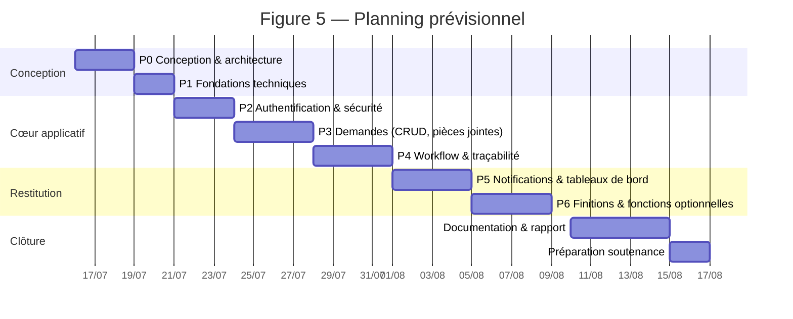
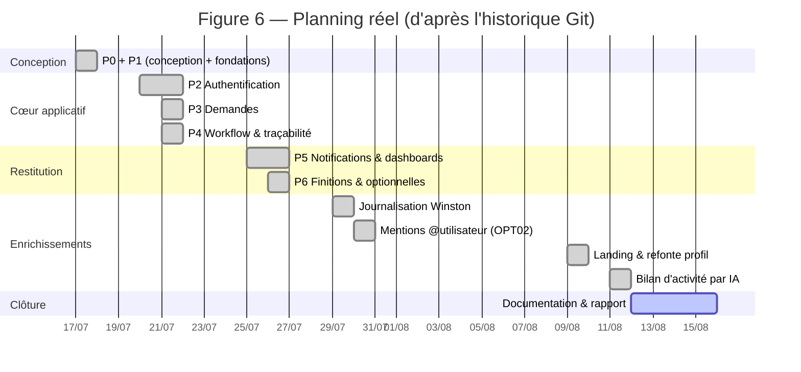
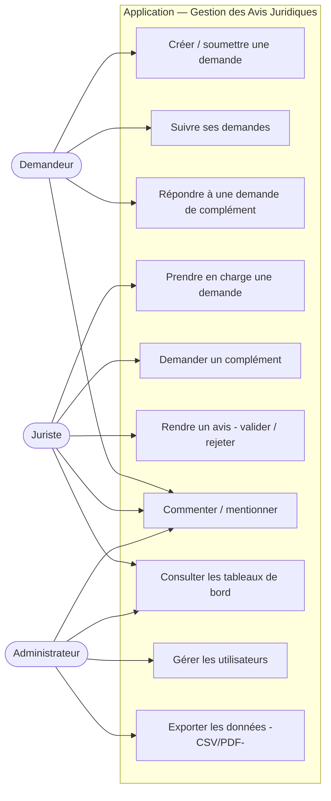
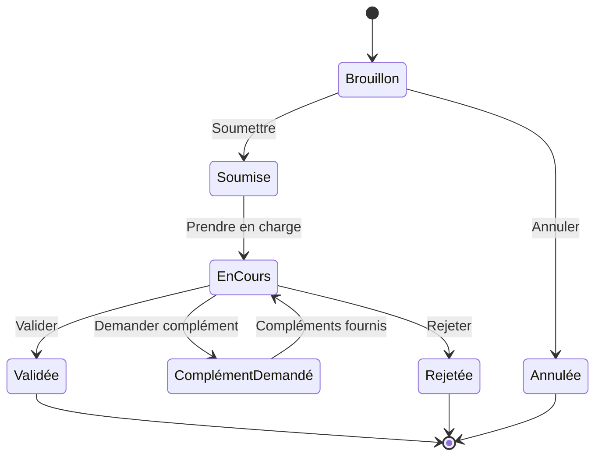
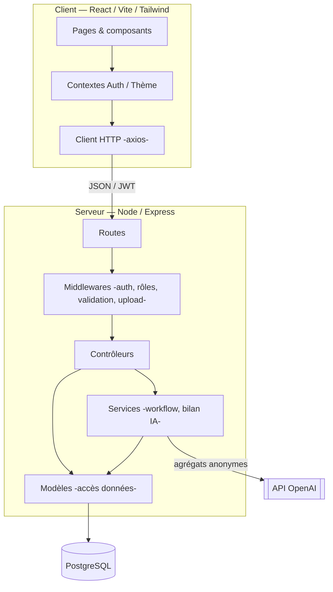

<!--
  RAPPORT DE STAGE — A2 CESI — Oussama BOUKERMA
  Document rédigé à partir du dépôt (code + documentation). Aucune donnée inventée :
  les éléments non présents dans le dépôt (chiffres d'entreprise, organigramme, captures
  d'écran, fiche de confidentialité signée) sont signalés par la mention [À COMPLÉTER].
  Conforme au « Guide de rédaction Rapport de Stage — A2 2025/2026 » (CESI).
  Format cible de dépôt : PDF nommé BOUKERMA_Oussama_RapportStage_A2.pdf
  Mise en page à appliquer à l'export : Arial 12, texte justifié, titres Arial gras.
-->

# Page de garde

**RAPPORT DE STAGE**

**Gestion des Avis Juridiques**
*Conception et réalisation d'une application web de suivi des demandes d'avis (stack PERN)*

- **Auteur :** Oussama BOUKERMA
- **École et promotion :** CESI — Exia, A2 — 2025/2026
- **Entreprise d'accueil :** Natixis Algérie — Direction des Affaires Juridiques (DAJ)
- **Localisation :** Alger, Algérie *(à préciser — [À COMPLÉTER])*
- **Période de stage :** du 16/07/2026 au 16/08/2026
- **Maître de stage (entreprise) :** Mme Mounia OUHARZOUNE
- **Tuteur pilote (école) :** Mme Maryam Amira CHENAOUI
- **Niveau de confidentialité :** *[À COMPLÉTER — ex. « Diffusion restreinte »]*

> *Note de mise en page : le titre du rapport doit tenir en 60 caractères maximum (guide CESI, §2). Le titre retenu « Gestion des Avis Juridiques » respecte cette contrainte ; le sous-titre est facultatif.*

---

# Fiche de confidentialité

*[À COMPLÉTER]* — Insérer ici le document de confidentialité remis en début de stage, **signé par le maître de stage et l'entreprise, puis scanné** (guide CESI, §3). Ce document ne peut pas être reconstitué automatiquement : il doit être fourni par l'étudiant.

---

# Remerciements

Je tiens à remercier Mme Mounia OUHARZOUNE, maître de stage au sein de la Direction des Affaires Juridiques de Natixis Algérie, pour son accueil, sa disponibilité et l'expression claire des besoins métier qui ont guidé ce projet.

Je remercie également Mme Maryam Amira CHENAOUI, tutrice pilote au CESI, pour son accompagnement pédagogique et ses conseils méthodologiques tout au long du stage.

Mes remerciements s'adressent enfin à l'ensemble des collaborateurs de la Direction des Affaires Juridiques qui ont contribué, par leurs retours, à la validation fonctionnelle de l'application.

---

# Résumé

La Direction des Affaires Juridiques de Natixis Algérie traite quotidiennement des demandes d'avis émanant de directions internes. Ces demandes étaient gérées de manière informelle, par messagerie, sans suivi centralisé, sans historique fiable ni visibilité sur les délais. Ce stage a consisté à concevoir et réaliser une application web centralisant le cycle de vie complet de ces demandes.

La solution développée repose sur une architecture PERN (PostgreSQL, Express, React, Node.js). Elle organise le travail autour de trois rôles — demandeur, juriste et administrateur — et d'un flux de traitement à sept statuts piloté par un moteur de transitions garantissant la cohérence des données et une traçabilité intégrale. Chaque changement d'état est journalisé de façon immuable et déclenche des notifications ciblées.

L'application couvre la création et le suivi des demandes, la gestion des pièces jointes, la collaboration par commentaires et mentions, des tableaux de bord statistiques par rôle, ainsi que la gestion des utilisateurs. Des fonctionnalités complémentaires ont été ajoutées : export CSV et PDF, journalisation structurée, et génération assistée par intelligence artificielle d'un bilan d'activité à partir de statistiques anonymisées.

Le projet a été conduit selon un découpage en phases successives, de la conception à la finition. Les objectifs fonctionnels initiaux ont été atteints ; le temps gagné sur le cœur applicatif a été réinvesti dans des fonctionnalités à valeur ajoutée et dans la robustesse. Le principal enseignement porte sur la maîtrise d'une architecture applicative complète, sécurisée et traçable, adaptée à un contexte métier exigeant.

*(≈ 250 mots)*

---

# Abstract

The Legal Affairs Department of Natixis Algeria handles a steady flow of advisory requests coming from internal divisions. These requests used to be managed informally through e-mail, with no central tracking, no reliable history and no visibility over processing times. The purpose of this internship was to design and build a web application that centralises the full life cycle of such requests.

The delivered solution is based on a PERN architecture (PostgreSQL, Express, React, Node.js). It structures the work around three roles — requester, legal officer and administrator — and around a seven-state processing flow driven by a transition engine that enforces data consistency and full traceability. Every state change is logged immutably and triggers targeted notifications.

The application supports request creation and tracking, attachment handling, collaboration through comments and user mentions, role-based statistical dashboards, and user management. Additional features were implemented: CSV and PDF export, structured logging, and AI-assisted generation of an activity report built solely from anonymised, aggregated statistics.

The project was carried out through a sequence of well-defined phases, from design to polishing. The initial functional goals were met; the time saved on the core application was reinvested in value-added features and in reliability. The main takeaway is the mastery of a complete, secure and auditable application architecture suited to a demanding business context.

*(≈ 240 words)*

---

# Table des matières

> *À générer automatiquement dans Word lors de la mise au propre (guide CESI, §6 : table automatique, 3 premiers niveaux, pagination continue dès la page de garde).* La structure ci-dessous en donne le plan.

1. Introduction
2. Présentation de l'entreprise d'accueil
3. Présentation de la mission
4. Gestion et planification du projet
5. Analyse et conception
6. Technologies utilisées
7. Architecture de l'application
8. Réalisation des fonctionnalités
9. Contribution personnelle
10. Tests et validation
11. Bilan
12. Conclusion
- Bibliographie
- Glossaire
- Annexes

---

# Table des figures

| N° | Figure | Nature | Statut |
|---|---|---|---|
| 1 | Diagramme de cas d'utilisation | Schéma (Mermaid) | Fourni |
| 2 | Machine à états des demandes (7 statuts) | Schéma (Mermaid) | Fourni |
| 3 | Modèle conceptuel de données (MCD) | Schéma | Renvoi Annexe B |
| 4 | Architecture en couches de l'application | Schéma (Mermaid) | Fourni |
| 5 | Planning prévisionnel (Gantt) | Diagramme | Fourni |
| 6 | Planning réel (Gantt) | Diagramme | Fourni |
| 7 | Écran de connexion | Capture | [À INSÉRER] |
| 8 | Formulaire de nouvelle demande | Capture | [À INSÉRER] |
| 9 | Liste des demandes filtrable et paginée | Capture | [À INSÉRER] |
| 10 | Détail d'une demande et actions de workflow | Capture | [À INSÉRER] |
| 11 | Fil de commentaires et mentions | Capture | [À INSÉRER] |
| 12 | Tableau de bord administrateur | Capture | [À INSÉRER] |
| 13 | Bilan d'activité généré par IA + export PDF | Capture | [À INSÉRER] |

---

# 1. Introduction

Le secteur bancaire est fortement encadré sur le plan juridique et réglementaire. Au sein d'une banque, la Direction des Affaires Juridiques (DAJ) est régulièrement sollicitée par les autres directions pour émettre des avis : validité d'une procuration, conformité d'un moyen de paiement, conditions de clôture d'un compte, analyse d'un dossier particulier. La qualité et la rapidité de ces avis conditionnent le bon déroulement des opérations.

Au moment du stage, ces demandes d'avis étaient adressées de façon informelle, principalement par courrier électronique. Cette organisation, souple en apparence, présente plusieurs faiblesses : absence de suivi centralisé, difficulté à retrouver l'historique d'un dossier, absence de mesure des délais, et risque de perte d'information. La **problématique** posée est donc la suivante : *comment structurer, tracer et fiabiliser le traitement des demandes d'avis juridiques, tout en respectant les rôles et les responsabilités de chaque acteur ?*

La mission confiée a consisté à concevoir et développer une application web répondant à ce besoin. Ce rapport n'est pas un journal de bord : il présente une analyse structurée de la mission. Après la présentation de l'entreprise (section 2) et de la mission (section 3), il détaille la démarche de gestion de projet (section 4), l'analyse et la conception (section 5), les technologies (section 6) et l'architecture retenues (section 7), puis la réalisation des fonctionnalités (section 8) et la contribution personnelle (section 9). Il se conclut par les tests et la validation (section 10), un bilan (section 11) et une conclusion (section 12).

---

# 2. Présentation de l'entreprise d'accueil

> *Guide CESI (§7.2) : 2 à 3 pages maximum. Les éléments chiffrés et l'organigramme précis ne figurent pas dans le dépôt du projet : ils sont signalés [À COMPLÉTER] et doivent être renseignés par l'étudiant à partir de sources internes ou publiques fiables, puis cités en bibliographie.*

## 2.1 Le groupe

Natixis est une banque de financement, de gestion et de services financiers. Elle constitue une filiale de **Groupe BPCE**, l'un des principaux groupes bancaires français. Natixis intervient notamment dans la banque de grande clientèle, la gestion d'actifs et de fortune, ainsi que les services financiers spécialisés.

*[À COMPLÉTER — histoire du groupe, dates clés, effectif, présence internationale, chiffres clés récents, avec sources citées en bibliographie.]*

## 2.2 Natixis en Algérie

Natixis est présente en Algérie à travers une entité bancaire locale, qui décline les métiers du groupe sur le marché algérien.

*[À COMPLÉTER — statut juridique de l'entité algérienne, date d'implantation, effectif, réseau, positionnement concurrentiel vis-à-vis des autres banques présentes en Algérie.]*

## 2.3 La Direction des Affaires Juridiques (DAJ)

Le stage s'est déroulé au sein de la **Direction des Affaires Juridiques**. Cette direction a pour mission de sécuriser juridiquement l'activité de la banque : elle émet des avis, contrôle la conformité des opérations et accompagne les autres directions sur les questions de droit. C'est cette activité d'émission d'avis, transverse à toute l'organisation, que le projet vient outiller.

*[À COMPLÉTER — positionnement de la DAJ dans l'organigramme, effectif de l'équipe, principaux interlocuteurs internes. Insérer l'organigramme en Figure/Annexe.]*

---

# 3. Présentation de la mission

## 3.1 Contexte métier et problématique

Une demande d'avis juridique suit, dans la réalité, un cycle simple : une direction « initiatrice » exprime un besoin, la DAJ l'analyse, éventuellement sollicite des compléments, puis rend un avis (favorable ou défavorable). Géré par messagerie, ce cycle n'est ni tracé ni mesurable. Les conséquences concrètes sont : des relances manuelles, une charge de recherche pour retrouver un échange ancien, et l'impossibilité de produire des indicateurs (volume, délais, taux de validation).

## 3.2 Objectifs du projet

L'objectif est de fournir une application qui :

1. **centralise** toutes les demandes d'avis dans un référentiel unique ;
2. **structure** leur traitement par un flux d'états explicite et contrôlé ;
3. **trace** l'intégralité des actions (qui a fait quoi, quand) de façon non modifiable ;
4. **respecte les rôles** : un demandeur, un juriste et un administrateur n'ont ni les mêmes droits ni la même visibilité ;
5. **restitue des indicateurs** de pilotage à la DAJ.

## 3.3 Périmètre fonctionnel (cahier des charges)

Le périmètre distingue deux profils principaux d'utilisateurs, complétés par un rôle d'administration.

| Acteur | Besoins principaux |
|---|---|
| **Demandeur** (direction initiatrice) | Créer une demande, y joindre un document, la soumettre, suivre son avancement, répondre à une demande de complément, consulter ses propres demandes uniquement. |
| **Juriste** (DAJ) | Consulter les demandes soumises, les prendre en charge, demander un complément, rendre un avis (validation/rejet motivé), suivre sa charge de travail. |
| **Administrateur** (DAJ) | Gérer les comptes utilisateurs, superviser l'ensemble des demandes, consulter les tableaux de bord globaux, exporter les données. |

Des fonctionnalités **optionnelles** (à valeur ajoutée) complètent ce socle : mode sombre, export CSV, fil de commentaires, export PDF d'une fiche avec QR code, et génération d'un bilan d'activité assistée par IA.

---

# 4. Gestion et planification du projet

## 4.1 Méthode de conduite

Le projet a été conduit selon un **découpage en phases successives** (P0 à P6), chaque phase étant précédée d'un document de plan et suivie d'une note d'avancement. Cette approche, proche d'un cycle incrémental, garantit qu'une fondation validée précède toujours la fonctionnalité qui s'appuie dessus : conception → fondations techniques → authentification → cœur métier → workflow et traçabilité → tableaux de bord → finitions. Les documents correspondants sont versionnés dans le dépôt (dossier `docs/`), ce qui assure la traçabilité de la démarche elle-même.

## 4.2 Planning prévisionnel

Le stage d'un mois a été planifié sur cinq semaines, avec une réserve finale pour la documentation et la préparation de la soutenance.

## 4.3 Planning réel

Le planning réel est reconstitué à partir de l'historique de versions du dépôt (dates des livraisons de chaque phase).

## 4.4 Analyse des écarts

L'écart principal est **favorable** : le cœur applicatif (P0 à P6) a été livré plus rapidement que prévu, l'essentiel étant réalisé entre le 17 et le 26 juillet. Trois facteurs expliquent cette avance :

- une **phase de conception préalable complète** (modèle de données, workflow, contrats d'API et maquettes d'écrans documentés dès P0), qui a limité les reprises ;
- la **réutilisation de patrons homogènes** entre modules (structure route → contrôleur → modèle/service identique partout) ;
- un périmètre initial **clairement borné**.

Le temps ainsi dégagé n'a pas été « perdu » : il a été **réinvesti** dans des fonctionnalités à valeur ajoutée (mentions, page de présentation, refonte du profil, bilan par IA) et dans la **robustesse** (journalisation structurée, fiabilisation des appels externes, pagination côté serveur). Cet arbitrage est assumé : il traduit un choix de qualité plutôt qu'une extension incontrôlée du périmètre. La seule vigilance associée est de veiller à ce que ces ajouts restent **documentés et testés** au même niveau que le socle — ce qui a été le cas.

---

# 5. Analyse et conception

## 5.1 Acteurs et cas d'utilisation

Trois acteurs interagissent avec le système. Le diagramme suivant synthétise leurs cas d'utilisation principaux.

*Figure 1 — Diagramme de cas d'utilisation. Il montre la séparation nette des responsabilités : le demandeur alimente le système, le juriste le traite, l'administrateur le supervise. Cette séparation est ensuite imposée techniquement par le contrôle d'accès par rôle (section 7).*

## 5.2 Le flux de traitement : une machine à états

Le cœur métier est modélisé comme une **machine à états** à sept statuts. Un statut ne peut évoluer que par des transitions autorisées, ce qui interdit les incohérences (par exemple, valider une demande jamais soumise).

| Statut | Nature | Signification |
|---|---|---|
| Brouillon | initial | En cours de saisie, non soumise |
| Soumise | actif | Envoyée à la DAJ, en attente de prise en charge |
| En cours | actif | Prise en charge par un juriste |
| Complément demandé | actif | Renvoyée au demandeur pour compléments |
| Validée | terminal | Avis favorable, dossier clos et verrouillé |
| Rejetée | terminal | Avis défavorable motivé, dossier clos et verrouillé |
| Annulée | terminal | Brouillon annulé par le demandeur |

*Figure 2 — Machine à états des demandes. Les états terminaux (Validée, Rejetée, Annulée) sont verrouillés : aucune modification n'est possible après clôture, ce qui garantit l'intégrité de l'avis rendu.*

## 5.3 Modèle de données

Le modèle repose sur cinq tables : `users` (comptes et rôles), `demande_avis` (entité centrale portant le statut et la pièce jointe), `historique_statuts` (journal **immuable** des transitions, en insertion seule), `notifications` (messages destinés aux utilisateurs) et `commentaires` (fil d'échange sur une demande). Le modèle conceptuel et logique complet (formalisme Merise) est documenté dans le dépôt et reporté en **Annexe B**.

Deux choix de conception méritent d'être soulignés :

- **La séparation de l'historique** dans une table dédiée en insertion seule : elle rend la traçabilité **infalsifiable** au niveau du modèle, indépendamment de l'applicatif.
- **Le statut n'est jamais modifié directement** : il l'est uniquement par le moteur de transitions (section 8.3), ce qui centralise les règles métier en un seul point.

---

# 6. Technologies utilisées

Le choix technologique s'est porté sur la **stack PERN**, cohérente (un seul langage, JavaScript, du serveur au navigateur) et adaptée à une application de gestion centrée sur les données.

| Couche | Technologie | Justification |
|---|---|---|
| Base de données | **PostgreSQL** | SGBD relationnel robuste ; contraintes d'intégrité (CHECK, clés étrangères) au plus près des données. |
| Serveur | **Node.js + Express** | Écosystème mûr, adapté aux API REST ; un seul langage sur toute la chaîne. |
| Interface | **React (Vite)** | Composants réutilisables, rendu réactif ; Vite pour un développement rapide. |
| Style | **Tailwind CSS** | Cohérence visuelle, mode sombre natif, productivité. |
| Sécurité | **JWT + bcrypt** | Authentification sans état par jeton ; mots de passe hachés. |
| Validation | **express-validator** | Contrôle systématique des entrées côté serveur. |
| Fichiers | **Multer** | Gestion des pièces jointes (téléversement contrôlé). |
| Graphiques | **Chart.js** | Tableaux de bord ; export image des graphiques. |
| Documents | **jsPDF, pdfkit, qrcode** | Génération de rapports PDF et QR codes. |
| Journalisation | **Winston** | Logs structurés (console + fichiers), essentiels à l'exploitation. |
| Assistance IA | **API OpenAI** | Rédaction d'un bilan à partir de statistiques anonymisées (section 8.9). |

*Note : conformément au guide (§7.2), le code source n'est pas reproduit dans ce rapport. Les choix ci-dessus sont justifiés par leur rôle dans l'architecture, non par des extraits de code.*

---

# 7. Architecture de l'application

## 7.1 Vue en couches

L'application suit une architecture **en couches**, avec une séparation stricte des responsabilités côté serveur : les routes reçoivent la requête, les contrôleurs orchestrent, les modèles accèdent aux données, et des services isolent la logique transverse (moteur de workflow, génération IA).

*Figure 4 — Architecture en couches. Le passage systématique par les middlewares (authentification, contrôle de rôle, validation) constitue une barrière de sécurité unique et cohérente. Aucun contrôleur n'accède directement à la base ou à un service externe sans passer par cette chaîne.*

## 7.2 Sécurité

La sécurité repose sur plusieurs mécanismes complémentaires : authentification par **jeton JWT**, **hachage bcrypt** des mots de passe, **contrôle d'accès par rôle** appliqué en middleware, **validation systématique** des entrées, et **filtrage des données par rôle** au niveau des requêtes (un demandeur ne peut voir que ses propres demandes). Les secrets (clé de signature JWT, clé OpenAI) sont conservés hors du code, dans des variables d'environnement non versionnées.

## 7.3 Traçabilité et journalisation

Deux niveaux de traçabilité coexistent : la **traçabilité métier** (historique immuable des transitions, consultable dans l'interface) et la **traçabilité technique** (journalisation Winston des requêtes HTTP et des erreurs, dans des fichiers dédiés). Cette distinction permet à la fois l'audit fonctionnel d'un dossier et le diagnostic d'exploitation.

---

# 8. Réalisation des fonctionnalités

> *Guide CESI (§7.2) : chaque capture doit être commentée (ce qu'elle montre, pourquoi ce choix, ce qu'elle démontre). Les captures marquées [À INSÉRER] sont à réaliser sur l'application en fonctionnement ; le commentaire d'analyse est déjà rédigé ci-dessous.*

## 8.1 Authentification et gestion de session

L'accès est protégé par une page de connexion. Après authentification, un jeton JWT est émis et conservé côté client ; il est renvoyé à chaque requête et vérifié par le serveur. La session est réhydratée au rechargement de la page.

> **Figure 7 — Écran de connexion.** *[À INSÉRER : `/login`]*
> *Commentaire :* l'écran illustre le point d'entrée unique de l'application. Il démontre la mise en place d'une authentification sans état (JWT), et l'option « se souvenir de moi » qui conditionne la persistance de la session. Ce choix évite de stocker un état de session côté serveur et simplifie le passage à l'échelle.

## 8.2 Création et suivi des demandes

Le demandeur crée une demande en renseignant un titre, un thème, un degré de sensibilité et un contenu, avec possibilité de joindre un document. La demande peut être enregistrée en brouillon puis soumise.

> **Figure 8 — Formulaire de nouvelle demande.** *[À INSÉRER : `/demandes/nouvelle`]*
> *Commentaire :* la capture démontre la validation des champs et la gestion de la pièce jointe. Le brouillon permet une saisie en plusieurs fois, ce qui reflète l'usage réel (préparation progressive d'un dossier).

> **Figure 9 — Liste des demandes.** *[À INSÉRER : `/demandes`]*
> *Commentaire :* la liste est **filtrable** (statut, thème, dates) et **paginée côté serveur** (seule la page demandée est chargée). Elle démontre deux préoccupations : l'ergonomie (retrouver rapidement une demande) et la performance (ne pas charger l'intégralité des enregistrements). La visibilité est adaptée au rôle : le demandeur ne voit que ses demandes.

## 8.3 Moteur de workflow et actions contextuelles

Le passage d'un statut à l'autre est assuré par un **moteur de transitions transactionnel**. Chaque transition vérifie ses pré-conditions (statut de départ, rôle, propriété du dossier), met à jour la demande, **inscrit une ligne d'historique** et **déclenche les notifications** appropriées — le tout dans une même transaction, garantissant qu'aucune de ces étapes ne peut aboutir sans les autres.

> **Figure 10 — Détail d'une demande et actions de workflow.** *[À INSÉRER : `/demandes/:id`]*
> *Commentaire :* la capture montre que les actions proposées **dépendent du statut et du rôle** (par exemple, « Valider » et « Rejeter » ne s'affichent que pour un juriste sur une demande « En cours »). Elle démontre l'application concrète de la machine à états : l'interface ne propose jamais une action interdite par le modèle.

## 8.4 Traçabilité : l'historique du dossier

Chaque demande présente une **frise chronologique** de ses changements d'état, alimentée par la table d'historique immuable. Ce composant répond directement à la problématique initiale (perte de l'historique) : il reconstitue, pour tout dossier, la suite exacte des décisions et leurs auteurs.

## 8.5 Notifications et mentions

Les événements du workflow génèrent des **notifications internes** (indicateur dans l'en-tête, relevé par interrogation périodique). Le fil de commentaires ajoute une dimension collaborative : un utilisateur peut **mentionner** un collègue avec la syntaxe `@`, ce qui déclenche une notification ciblée. La recherche des personnes à mentionner est **paginée** et se charge au fil de la saisie, afin de rester légère même avec un annuaire important.

> **Figure 11 — Fil de commentaires et mentions.** *[À INSÉRER : section commentaires d'une demande]*
> *Commentaire :* la capture démontre l'ergonomie « réseau social » de la mention (liste déroulante, insertion au clic, personnes notifiées visibles) et la notification ciblée qui en résulte. Elle illustre un souci d'efficacité : seules les données nécessaires sont chargées, par lots.

## 8.6 Tableaux de bord par rôle

Chaque rôle dispose d'un tableau de bord adapté : le demandeur suit ses demandes, le juriste sa charge de travail, l'administrateur une vue globale (répartition par statut, par thème, par sensibilité, évolution mensuelle, indicateurs de délai et de taux de validation). Les graphiques sont réalisés avec Chart.js.

> **Figure 12 — Tableau de bord administrateur.** *[À INSÉRER : accueil administrateur]*
> *Commentaire :* la capture démontre la restitution d'indicateurs de pilotage — précisément ce qui manquait dans l'organisation par messagerie. Chaque graphique est exportable en image, et l'ensemble est exportable en rapport PDF.

## 8.7 Gestion des utilisateurs

L'administrateur crée, modifie, active ou désactive les comptes, et attribue les rôles. La liste est paginée. La désactivation (plutôt que la suppression) préserve l'intégrité de l'historique : un utilisateur désactivé reste référencé dans les dossiers passés.

## 8.8 Fonctionnalités complémentaires

- **Mode sombre** persistant, appliqué à toute l'interface.
- **Export CSV** de la liste des demandes (administrateur), respectant les filtres courants.
- **Export PDF d'une fiche** de demande, avec **QR code** renvoyant à la demande en ligne.
- **Page de présentation** publique et **profil** utilisateur repensé.

## 8.9 Bilan d'activité assisté par IA

Une fonctionnalité avancée permet à l'administrateur de générer un **bilan d'activité rédigé** à partir des statistiques du tableau de bord. Le principe directeur est la **confidentialité par conception** : seules des **données agrégées et anonymes** (compteurs, taux, moyennes) sont transmises au service d'IA ; aucune donnée nominative ni aucun contenu de demande n'en sort. Les chiffres sont calculés par la base ; l'IA se limite à en **rédiger l'analyse**, ce qui écarte tout risque d'invention de valeurs. Le bilan est affiché à l'écran et exportable en **rapport PDF complet** (indicateurs, analyse et graphiques). Le détail de conception de cette fonctionnalité est documenté dans le dépôt (Annexe C).

> **Figure 13 — Bilan d'activité par IA.** *[À INSÉRER : panneau « Bilan d'activité (IA) » du tableau de bord]*
> *Commentaire :* la capture démontre la valeur ajoutée (transformer des chiffres en analyse exploitable) tout en matérialisant le garde-fou de confidentialité affiché à l'utilisateur. Elle illustre une réflexion sécurité **et** conformité, adaptée au contexte bancaire.

---

# 9. Contribution personnelle

> *[POINT DE VIGILANCE — à ajuster par l'étudiant selon la réalité : le dépôt ne mentionne pas explicitement de binôme. La section est rédigée sur l'hypothèse d'une réalisation individuelle. En cas de travail en binôme, distinguer ici précisément les modules portés par chacun.]*

La réalisation de l'application, de la conception à la livraison, a constitué ma contribution centrale. J'ai pris en charge :

- la **conception** initiale (modèle de données, machine à états, contrats d'API, maquettes d'écrans) ;
- l'**implémentation du serveur** (authentification, cœur métier des demandes, moteur de workflow transactionnel, notifications, statistiques) ;
- l'**implémentation de l'interface** (pages, composants, tableaux de bord, ergonomie) ;
- la mise en place de la **sécurité** (JWT, rôles, validation) et de la **journalisation** ;
- les **fonctionnalités à valeur ajoutée** (mentions, exports, bilan IA) et la **documentation** du projet.

Au-delà du code, une part importante de la contribution a porté sur la **démarche** : découpage en phases, documentation systématique et arbitrages techniques justifiés (par exemple, le choix d'un historique immuable ou l'anonymisation stricte des données envoyées à l'IA).

---

# 10. Tests et validation

## 10.1 Stratégie

La validation a combiné plusieurs approches : **contrôles d'intégrité au niveau de la base** (contraintes CHECK sur les statuts et les rôles, clés étrangères), **validation systématique des entrées** côté serveur, **recette fonctionnelle manuelle** guidée par un questionnaire de validation versionné dans le dépôt, et **vérification de bout en bout** des scénarios de workflow (chaque transition, y compris les cas d'erreur : action non autorisée, mauvais statut, dossier verrouillé).

## 10.2 Jeu de données de démonstration

Un générateur de **données de démonstration cohérentes** (comptes de chaque rôle, demandes réparties sur tous les statuts et étalées dans le temps) a été développé. Il permet d'éprouver l'application dans des conditions réalistes : pagination visible, tableaux de bord significatifs, historique fourni.

## 10.3 Limites de la validation

*[Présentation maîtrisée des limites, conformément au guide.]* La validation repose principalement sur une recette manuelle et des vérifications ciblées ; elle **ne comprend pas de suite de tests automatisés** exhaustive. Dans une perspective de mise en production, l'ajout de tests automatisés (unitaires sur le moteur de workflow, d'intégration sur les routes) constituerait la première consolidation à apporter. Cette limite est assumée et identifiée comme axe d'amélioration prioritaire (section 11).

---

# 11. Bilan

## 11.1 Retour sur les objectifs

| Objectif initial | État | Preuve |
|---|---|---|
| Centraliser les demandes | Atteint | Référentiel unique, liste filtrable |
| Structurer le traitement | Atteint | Machine à états à 7 statuts, moteur transactionnel |
| Tracer les actions | Atteint | Historique immuable + journalisation |
| Respecter les rôles | Atteint | Contrôle d'accès par rôle, visibilité filtrée |
| Restituer des indicateurs | Atteint | Tableaux de bord par rôle + bilan IA |

L'ensemble des objectifs fonctionnels initiaux a été atteint, et le périmètre a été enrichi de fonctionnalités complémentaires.

## 11.2 Indicateurs (KPI proposés)

Pour le pilotage en exploitation, l'application permet de suivre notamment : le **volume de demandes** (total et par période), la **répartition par statut / thème / sensibilité**, le **délai moyen de traitement**, le **taux de validation / de rejet**, et le **nombre de demandes en retard**. Ces indicateurs sont ceux qui faisaient défaut dans l'organisation initiale ; ils constituent la principale valeur de pilotage apportée.

## 11.3 Compétences développées

- **Techniques :** conception de bases de données relationnelles, développement d'API REST sécurisées, développement d'interfaces React, mise en œuvre d'un contrôle d'accès par rôle, journalisation, intégration d'un service d'IA externe.
- **Méthodologiques :** découpage d'un projet en phases, documentation technique, arbitrages justifiés, gestion des écarts de planning.
- **Métier :** compréhension du fonctionnement d'une direction juridique et traduction d'un besoin métier en flux applicatif.

## 11.4 Limites et perspectives

- **Tests automatisés** : les ajouter en priorité (moteur de workflow, routes).
- **Notifications temps réel** : remplacer l'interrogation périodique par une diffusion événementielle (WebSocket).
- **Souveraineté des données pour l'IA** : en production réelle, remplacer l'API publique par un service maîtrisé par la banque (Azure OpenAI ou modèle interne), l'architecture étant déjà indépendante du fournisseur.
- **Déploiement** : industrialiser la mise en production (conteneurisation, intégration continue).

---

# 12. Conclusion

Le stage répond à la problématique posée : l'application développée **structure, trace et fiabilise** le traitement des demandes d'avis juridiques, là où l'organisation initiale reposait sur des échanges informels non traçables. Les objectifs fixés ont tous été atteints, et le socle a été enrichi de fonctionnalités à valeur ajoutée sans jamais compromettre la cohérence de l'ensemble.

Sur le plan personnel, ce projet a permis de mener une réalisation logicielle **complète** — de la conception du modèle de données à la restitution d'indicateurs — dans un cadre professionnel exigeant. Il illustre la capacité à traduire un besoin métier en une solution technique cohérente, sécurisée et défendable. Les perspectives identifiées (tests automatisés, temps réel, industrialisation) dessinent le chemin restant pour faire de ce prototype abouti un produit prêt pour un déploiement en production.

---

# Bibliographie

> *Références conformes ISO 690 (à compléter avec les dates de consultation réelles).*

1. GROUPE BPCE. *Natixis — présentation du groupe*. [En ligne]. Disponible sur <https://www.groupebpce.com>. Consulté le [JJ/MM/2026].
2. MOZILLA. *MDN Web Docs — JavaScript, HTTP, Web APIs*. [En ligne]. Disponible sur <https://developer.mozilla.org>. Consulté le [JJ/MM/2026].
3. POSTGRESQL GLOBAL DEVELOPMENT GROUP. *PostgreSQL Documentation*. [En ligne]. Disponible sur <https://www.postgresql.org/docs/>. Consulté le [JJ/MM/2026].
4. OPENJS FOUNDATION. *Node.js Documentation*. [En ligne]. Disponible sur <https://nodejs.org/docs/>. Consulté le [JJ/MM/2026].
5. EXPRESS. *Express — Node.js web application framework*. [En ligne]. Disponible sur <https://expressjs.com>. Consulté le [JJ/MM/2026].
6. META (REACT TEAM). *React Documentation*. [En ligne]. Disponible sur <https://react.dev>. Consulté le [JJ/MM/2026].
7. TAILWIND LABS. *Tailwind CSS Documentation*. [En ligne]. Disponible sur <https://tailwindcss.com/docs>. Consulté le [JJ/MM/2026].
8. CHART.JS CONTRIBUTORS. *Chart.js Documentation*. [En ligne]. Disponible sur <https://www.chartjs.org/docs/>. Consulté le [JJ/MM/2026].
9. AUTH0. *JSON Web Tokens — Introduction*. [En ligne]. Disponible sur <https://jwt.io/introduction>. Consulté le [JJ/MM/2026].
10. OPENAI. *OpenAI API Reference*. [En ligne]. Disponible sur <https://platform.openai.com/docs>. Consulté le [JJ/MM/2026].

---

# Glossaire

| Terme / Abréviation | Définition |
|---|---|
| **API** | Interface de programmation permettant à deux logiciels de communiquer. |
| **CRUD** | Créer, Lire, Mettre à jour, Supprimer — opérations de base sur des données. |
| **DAJ** | Direction des Affaires Juridiques. |
| **JWT** | *JSON Web Token* — jeton signé porteur de l'identité de l'utilisateur. |
| **KPI** | *Key Performance Indicator* — indicateur clé de performance. |
| **MCD / MLD** | Modèle Conceptuel / Logique de Données (méthode Merise). |
| **PERN** | PostgreSQL, Express, React, Node.js — pile technologique utilisée. |
| **REST** | Style d'architecture pour les API web basé sur HTTP. |
| **SGBD** | Système de Gestion de Base de Données. |
| **Workflow** | Flux de traitement : enchaînement contrôlé d'états et de transitions. |

---

# Annexes

> *Annexes référencées dans le corps du texte et titrées (guide CESI, §10). Le code source n'est volontairement pas inclus (guide CESI, §7.2).*

- **Annexe A — Cahier des charges détaillé** : liste des exigences fonctionnelles par rôle (source : documentation de conception du dépôt, `docs/`).
- **Annexe B — Modèle de données (MCD / MLD, Merise)** : schémas issus de `docs/DATABASE.md`.
- **Annexe C — Note de conception « Bilan d'activité par IA »** : principes de confidentialité et architecture (source : `docs/FONCTIONNALITE-BILAN-IA.md`).
- **Annexe D — Fiches de transition du workflow** : pré-conditions, effets et notifications de chaque transition (source : `docs/WORKFLOW.md`).
- **Annexe E — Captures d'écran complémentaires** : [À INSÉRER].
- **Annexe F — Fiche de confidentialité signée** : [À INSÉRER].
